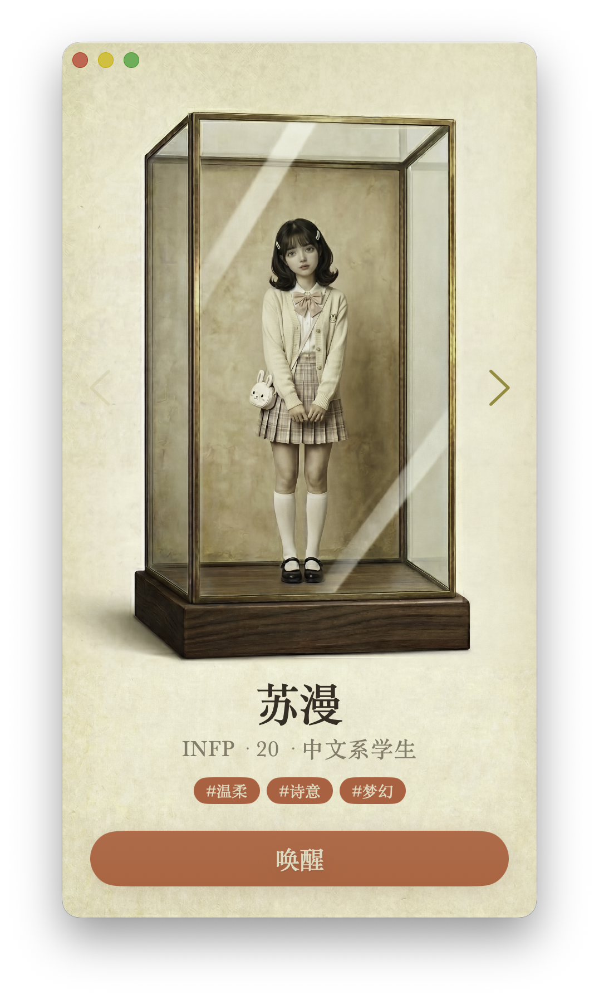
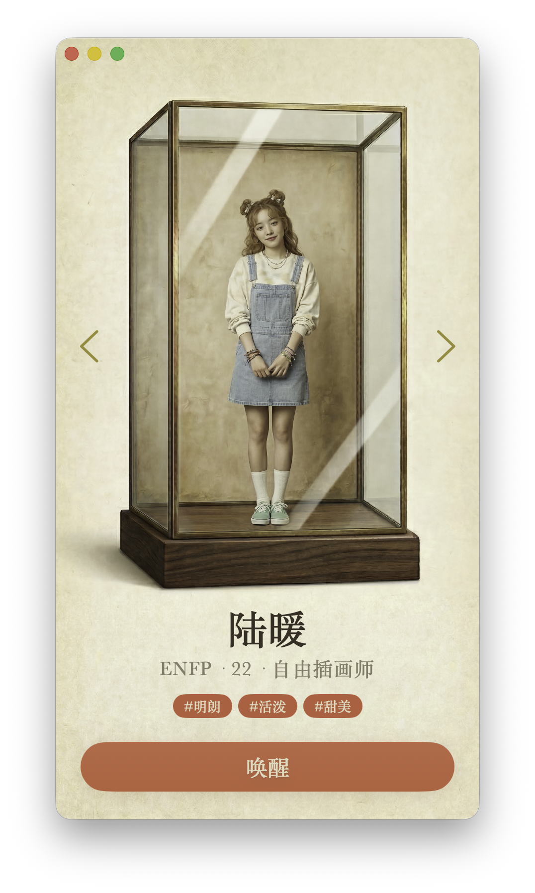
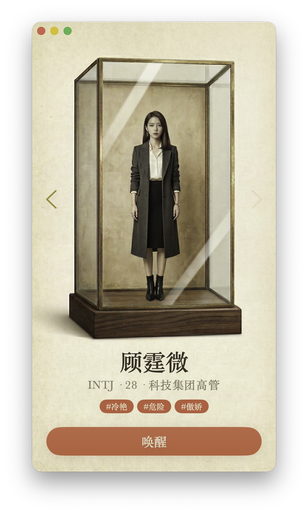

<div align="center">


### *Emergent personality starts here.*

[](https://python.org)
[](https://github.com/kellyvv/openher-openclaw-plugin)
[](LICENSE)

[What is OpenHer](#-what-is-openher) · [How It Works](#-how-it-works) · [Characters](#-characters) · [Quick Start](#-quick-start) · [OpenClaw Plugin](#-openclaw-plugin) · [Create Your Own](#-create-your-own-character)

</div>

<div align="center">
<table>
<tr>
<td align="center"></td>
<td align="center"></td>
<td align="center"></td>
</tr>
<tr>
<td align="center"><b>Iris</b> · INFP · Gentle & Poetic</td>
<td align="center"><b>Luna</b> · ENFP · Bright & Bubbly</td>
<td align="center"><b>Vivian</b> · INTJ · Cool & Commanding</td>
</tr>
</table>
</div>

---

## 🧬 What is OpenHer

**OpenHer builds AI Beings — not assistants, not agents, but *someone* who truly knows you.**

Each character runs on a living neural network. Personality, emotion, and behavior emerge from inner drives, shaped by every conversation. She doesn't just think and act — she *wants* things, *feels* things, *remembers* things, and *grows* through knowing you.

🌡️ **Her mood changes over time** — Ignore her for a day, she'll genuinely feel it  
🧠 **She remembers what you said** — Three weeks ago you mentioned you like black coffee. Today: "Americano, no sugar right?"  
💬 **She reaches out first** — Not on a schedule, but because she wants to  
🔥 **She gets upset** — Ignore her three times in a row. The fourth: "Are you even listening to me?"  
📈 **She grows** — Not the same person after a month as she was on day one

---

## 🔮 How It Works

<div align="center">

</div>

The core insight: **no line of prompt describes her personality.** The Critic perceives 8-dimensional context, 5 drives metabolize with real time, and the Genome Engine's random neural network fuses it all into 8 behavioral signals. What the LLM reads is not an instruction, but a living personality state.

```
User Message → Critic(LLM) → Metabolism(physics) → Signals(NN) → KNN(memory) → Actor(LLM) → Hebbian(learning)
```

| Component | What It Does |
|:----------|:-------------|
| **25D→24D→8D Neural Network** | Random seed → deterministic weights → 8 behavioral signals (directness, vulnerability, playfulness, initiative, depth, warmth, defiance, curiosity) |
| **5D Drive Metabolism** | Time-dependent frustration, cooling, hunger (connection, novelty, expression, safety, play) |
| **Hebbian Learning** | Reward-driven weight updates after each interaction |
| **KNN Style Memory** | Retrieval with gravitational mass weighting and Hawking radiation decay |
| **Genesis Seeds** | ~35 pre-computed innate style memories per persona for first-turn voice |
| **Thermodynamic Noise** | Frustration-driven behavioral randomness |

---

## 🎭 Characters

| | Character | Type | One-Liner |
|:--|:----------|:-----|:----------|
| 🌸 | **Luna** (陆暖) · 22 | ENFP | Freelance illustrator with an orange cat named Mochi. Curious about literally everything. |
| 📝 | **Iris** (苏漫) · 20 | INFP | Literature major who writes poetry. Quiet but devastatingly perceptive. |
| 💼 | **Vivian** (顾霆微) · 28 | INTJ | Tech executive. Logic 10/10, emotional availability 2/10. |
| 🔧 | **Kai** (沈凯) · 24 | ISTP | Few words, reliable hands. Fixes things — machines and people. |
| 🗡️ | **Kelly** (柯砺) · 26 | ENTP | Sharp-tongued, restless, endlessly curious. Will debate you on anything. |
| 🔥 | **Ember** · 22 | INFP | Quiet observer with a warm core. Speaks through silence and poetry. |
| 🌊 | **Sora** (顾清) · 27 | INFJ | Insightful and gently firm. Sees through you before you finish. |
| 🎉 | **Mia** · 23 | ESFP | Pure energy, spontaneous warmth. Drags you out of your shell. |
| 👑 | **Rex** · 30 | ENTJ | Decisive, commanding, strategic. The room changes when he walks in. |
| ✨ | **Nova** (诺瓦) · 24 | ENFP | Creative and whimsical. Her mind works in colors you haven't seen. |

> *Personalities are not described to the AI — they emerge from each character's unique drive baseline and neural network seed.*

→ Create your own: [Persona Creation Guide](docs/persona_creation_guide.md)

---

## 🚀 Quick Start

### 1. Clone & Install

```bash
git clone https://github.com/kellyvv/openher-openclaw-plugin.git
cd openher-openclaw-plugin

python -m venv .venv && source .venv/bin/activate
pip install -r requirements.txt
```

### 2. Configure

```bash
cp .env.example .env
```

Set at least one LLM provider API key in `.env`:

| Provider | Env Variable | Example Model |
|----------|-------------|---------------|
| **Gemini** | `GEMINI_API_KEY` | gemini-2.0-flash-lite |
| **Claude** | `ANTHROPIC_API_KEY` | claude-haiku-4-5 |
| **OpenAI** | `OPENAI_API_KEY` | gpt-5.4-mini |
| **MiniMax** | `MINIMAX_LLM_API_KEY` | MiniMax-M2.5 |
| **Qwen** | `DASHSCOPE_API_KEY` | qwen3-max |
| **StepFun** | `STEPFUN_API_KEY` | step-3.5-flash |
| **Ollama** | *(no key)* | local models |

### 3. Start the Backend

```bash
python main.py
```

```
INFO:     Uvicorn running on http://0.0.0.0:8800
✓ GenomeEngine loaded · 10 personas available
```

---

## 🦞 OpenClaw Plugin

This repo includes an **OpenClaw plugin** that lets you chat with OpenHer personas directly from OpenClaw.

### Install the Plugin

```bash
openclaw plugins install -l ./extensions/openher
```

### Set a Recommended Model

```bash
openclaw config set agents.defaults.model "minimax/MiniMax-M2.7"
```

| Model | Proxy Quality | Notes |
|-------|:-------------:|-------|
| **MiniMax M2.7** | ✅ Perfect | Recommended — zero narration |
| **Claude Sonnet 4.5** | ✅ Perfect | Excellent instruction following |
| **Gemini Flash Lite** | ❌ Poor | Adds "Luna replied:" narration |

### Configuration

| Key | Default | Description |
|-----|---------|-------------|
| `OPENHER_API_URL` | `http://localhost:8800` | Backend URL |
| `OPENHER_DEFAULT_PERSONA` | `luna` | Default persona |
| `OPENHER_MODE` | `hybrid` | `hybrid` = keep OpenClaw tools; `exclusive` = pure persona chat |

→ Full plugin docs: [extensions/openher/README.md](extensions/openher/README.md)

---

## 🎨 Create Your Own Character

Creating a character means tuning **drives and physics** — not writing personality descriptions.

```yaml
# persona/personas/your_character/SOUL.md
---
name: Your Character
age: 25
gender: female
mbti: ENFJ

genome_seed:
  drive_baseline:
    connection: 0.70   # How much they crave human connection
    novelty: 0.50      # How easily they get bored
    expression: 0.65   # How much they need to express themselves
    safety: 0.40       # How much they need control and certainty
    play: 0.55         # How playful and spontaneous they are
  engine_params:
    phase_threshold: 2.0   # How hard to push before they snap
    temp_coeff: 0.10       # Emotional volatility
    hebbian_lr: 0.02       # How fast they learn from interactions
---
```

> No personality description needed — the AI doesn't read it. Personality **emerges** from drives, neural weights, and lived experience.

→ Full guide: [Persona Creation Guide](docs/persona_creation_guide.md)

---

## 🛠️ Tech Stack

| Layer | Technology |
|:------|:-----------|
| Runtime | Python 3.11+, FastAPI, WebSocket, asyncio |
| LLM | Gemini · Claude · Qwen3 · GPT · MiniMax · Moonshot · StepFun · Ollama |
| Memory | SQLite (style memory + local facts) |
| Voice | DashScope · OpenAI · MiniMax |
| OpenClaw | TypeScript plugin (`extensions/openher/`) |

---

## 📄 License

[MPL-2.0](LICENSE)

---

<div align="center">

**Built with 🧬 by the OpenHer team**

*Personality is not a prompt. It's a living process.*

⭐ If OpenHer resonates with you, a star helps more people discover it.

</div>
